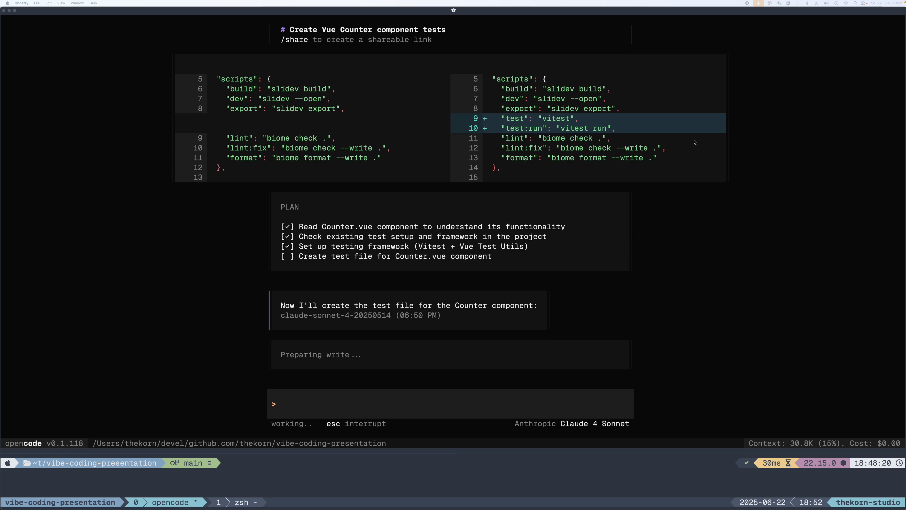

# Idea
## What it's NOT!

<div class="flex flex-col gap-10">
    <div class="grid grid-cols-2 gap-4">
        <ul>
            <li>Code assistant
            <ul>
                <li>improved <b>auto completion</b> ❌</li>
                <li> <b>inline / chat</b> features ❌
```
/doc
```
```
/explain
```
```
/fix
```
                </li>
            </ul>
            </li>
            <li><b>Read</b> code ❌</li>
        </ul>
        <div>
            <!--
            <a href="https://youtu.be/hQXzSr-GRRo" target="_blank">
                
            </a>
            -->
            <a href="./pages/videos/inline-doc.mp4" target="_blank">
                
            </a>
            <a href="https://youtu.be/hQXzSr-GRRo" target="_blank" class="mt-8 text-xs">
                youtube
            </a>
        </div>
    </div>

  <blockquote class="mt-8 text-sm opacity-75 !border-red">
      <em>Editors/IDEs like VSCode or Cursor are not the best tools for vibe coding</em>
  </blockquote>
</div>

---
title: idea - what it is!
---

# Idea
## What it IS!

<div class="flex flex-col gap-10">
    <div class="grid grid-cols-2 gap-4">
        <div class="flex gap-4 flex-col">
            <ul>
                <li><b>Don't</b> look at code ✅</li>
                <li><b>Don't</b> take decisions ✅</li>
            </ul>
            <h3>Just chat!</h3>
            <i>
                <blockquote>create tests for the Counter.vue component in components/ folder</blockquote>
            </i>
        </div>
        <div>
            <!--
            <a href="https://youtu.be/zYcvw5OHHH0" target="_blank">
                
                </a>
            -->
            <a href="./pages/videos/opencode-vibe-test.mp4" target="_blank">
                
            </a>
            <a href="https://youtu.be/zYcvw5OHHH0" target="_blank" class="mt-8 text-xs">
                youtube
            </a>
        </div>
    </div>
    <blockquote class="mt-8 text-sm opacity-75 !border-red">
        <em>
            Tools like claude-cli or opencode are hiding the code, they are perfect for vibe coding
        </em>
    </blockquote>
</div>
