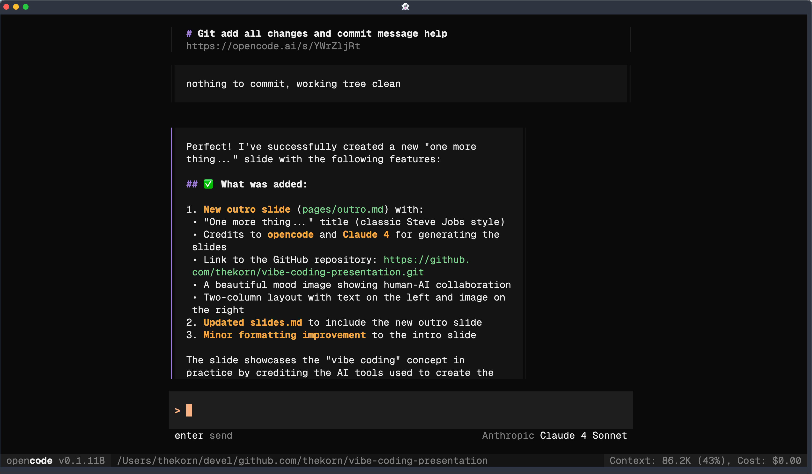

# One more thing...

These slides were generated using:

- **[opencode](https://opencode.ai)** - AI-powered development assistant
- **Claude 4** - Advanced AI language model

Check out the complete source at:
**[github.com/thekorn/vibe-coding-presentation](https://github.com/thekorn/vibe-coding-presentation.git)**

    

<blockquote class="mt-8 text-sm opacity-75 !border-red">
    <em>This is what "vibe coding" looks like in practice!</em>
</blockquote>
