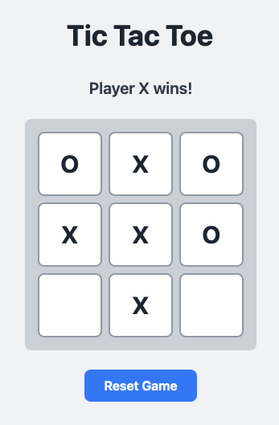

# Learn
## weekend projects

    

        

            <h3>Describe your project, and get a coffee ☕</h3>
            <i>
                <blockquote>create a simple tic-tac-toe game using solid-js, typescript and tailwindcss and implement basic tests using vitest. git commit changes whenever it makes sense.</blockquote>
            </i>
            <h3>Success 🥳, but ...</h3>
            <ul>
                <li>works best for common stacks... Want to learn zig, or write a game using lua? - 💣</li>
                <li>You are not learning much... 🧑‍🎓</li>
            </ul>
        

        

            
            <a href="https://youtu.be/iE1O0luzrEM" target="_blank" class="mt-8 text-xs">
                youtube
            </a>
        

    

    <blockquote class="mt-8 text-sm opacity-75 !border-red">
        <em>
            Result of the prompt above: <a href="https://github.com/thekorn/vibe-coding-presentation/tree/main/examples/tic-tac-toe" target="_blank">https://github.com/thekorn/vibe-coding-presentation</a>
        </em>
    </blockquote>

